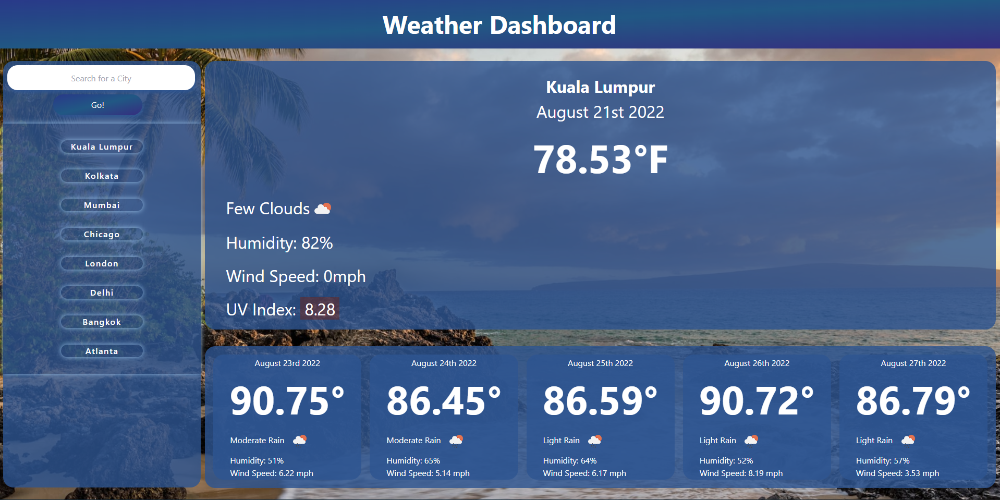

# 06 Server-Side APIs: Weather Dashboard

## Description of Application

This application uses the OpenWeather API to create a Weather Dashboard for user. When city is searched (either by pressing go or hitting "Enter" key), the app forecasts the current weather conditions as well as a 5-day forecast for city. UV Index is included for current day and color coded by favorable, moderate, and severe. All searches save to local storage, and upon refresh populate as clickable buttons to re-search (latest search populates first). Also includes a unique background image per reload. 


## User Experience

```md
GIVEN a weather dashboard with form inputs
WHEN I search for a city
THEN I am presented with current and future conditions for that city and that city is added to the search history
WHEN I view current weather conditions for that city
THEN I am presented with the city name, the date, an icon representation of weather conditions, the temperature, the humidity, the wind speed, and the UV index
WHEN I view the UV index
THEN I am presented with a color that indicates whether the conditions are favorable, moderate, or severe
WHEN I view future weather conditions for that city
THEN I am presented with a 5-day forecast that displays the date, an icon representation of weather conditions, the temperature, the wind speed, and the humidity
WHEN I click on a city in the search history
THEN I am again presented with current and future conditions for that city
```

## APIs Used
- OpenWeather API
- Moment.js
- Tailwind CSS

## Mock-Up

The following image shows the web application's appearance and functionality:

[Weather Dashboard Live Link](https://isayani.github.io/server-side-weather-dashboard/)



- - -
© 2022 ISayani Creative Services, Confidential and Proprietary. All Rights Reserved.
